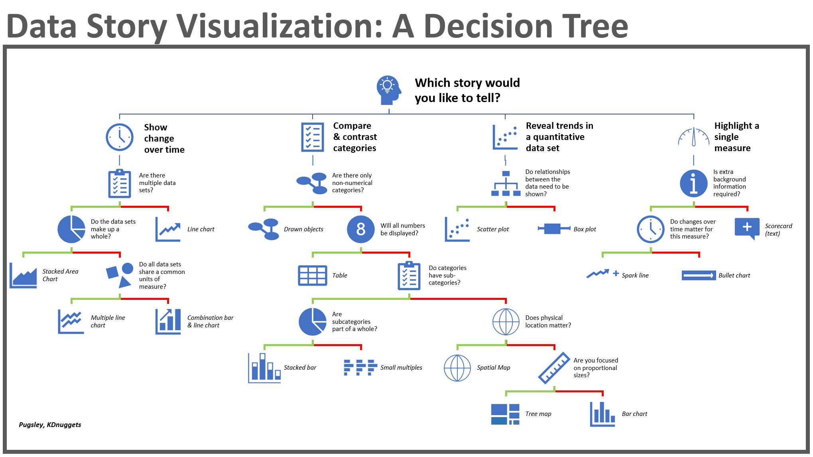

# Dataviz Tips & Tricks

Some Tips and Tricks about Dataviz.

     

## Useful documents

* [Before starting a dashboard project](./docs/Before-starting-a-dashboard-project.md) - Some questions to ask yourself before starting a dashboard project
* [Comparison criteria for dataviz solutions](./docs/Comparison-criteria-for-dataviz-solutions.md)

## Useful resources

## Useful links

* [Kibana best practices](https://www.elastic.co/guide/en/kibana/master/development-best-practices.html) - Best practices from Elastic

## Tomorrow I will learn

* [Apache Superset](https://superset.apache.org/docs/intro) - Business intelligence web application
* [Datasette](https://datasette.io/) - Open source multi-tool for exploring and publishing data

### Kibana

* [Best Practices for Using Kibana for Data Visualization](https://dzone.com/articles/best-practices-for-using-kibana-for-data-visualiza#:~:text=The%20Best%20Practices%20for%20Using%20Kibana%20for%20Data,of%20data%20in%20question.%20...%20Plus%20d%27articles...%20)
* [Tips, Considerations, & Best Practices](https://elire.com/2020/12/kibana-tips-considerations-best-practices/)
* [Creating the Perfect Kibana Dashboard](https://logz.io/blog/perfect-kibana-dashboard/)

## Build with

* [Git](https://git-scm.com) - Open source distributed version control system

## Contributing

If you would like to contribute, read the CONTRIBUTING.md file to learn how to do so.
